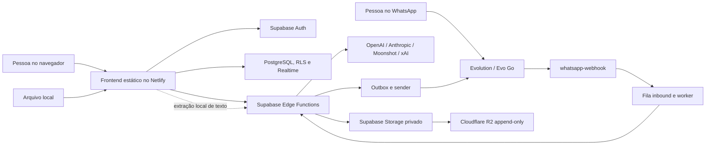

# Inventário e governança de dados

> Estado técnico verificado em 2026-07-15 para a Etapa 6 / Fatia 6A. Este documento descreve o comportamento atual; não constitui parecer jurídico nem define sozinho a base legal de tratamento.

## 1. Escopo e responsáveis

O inventário cobre 58 tabelas `public`, Supabase Auth e Storage, 31 Edge Functions configuradas, o frontend Netlify, WhatsApp/Evolution, quatro provedores de IA, pesquisa web e a réplica Cloudflare R2. Arquivos brutos processados apenas em memória também entram no mapa, mesmo quando não viram linha no banco.

A empresa cliente decide por que e como usa os dados de seus colaboradores, planos e operação dentro do Oráculo. A posição contratual do fornecedor do Oráculo, dos provedores de infraestrutura e dos provedores de IA precisa ser formalmente validada pelo responsável jurídico antes de transformar o aviso operacional da Fatia 6B em política contratual definitiva. A referência técnica para distinguir controlador, operador e suboperador é o [Guia de agentes de tratamento da ANPD](https://www.gov.br/anpd/pt-br/assuntos/noticias/nova-versao-do-guia-dos-agentes-de-tratamento).

Bases legais não são inferidas pelo código. Até a validação responsável, a coluna equivalente deste inventário permanece como `a definir`, especialmente para cadastro, comunicações por WhatsApp, telemetria, auditoria, IA e retenção histórica. Consentimento não deve ser usado como resposta genérica quando outra hipótese for a aplicável.

## 2. Classificação usada

| Código | Classe | Exemplos no Oráculo |
| --- | --- | --- |
| `P` | Dado pessoal | nome, email, telefone, autoria, identificadores e conversa ligada a uma pessoa |
| `PS?` | Possível dado pessoal sensível em campo livre | saúde, convicção, biometria ou outro conteúdo que alguém inclua em chat, áudio ou documento, embora o produto não solicite isso |
| `E` | Informação empresarial confidencial | estratégia, metas, finanças, produção, responsáveis, bloqueios e documentos |
| `S` | Segredo ou credencial | chave de IA/Evolution, webhook, cron, token e configuração de endpoint privilegiado |
| `T` | Telemetria técnica sanitizada | código, status, contagem, custo, latência e identificador sem conteúdo |

Todo conteúdo livre (`chat_messages`, documentos, evidências, propostas, transcrições e planos) deve ser tratado como `P/PS?/E`, pois a estrutura técnica não impede que uma pessoa cite terceiros ou inclua informações sensíveis. Informação empresarial não é automaticamente dado pessoal, mas permanece privada por contrato e RLS.

## 3. Fluxo geral

### 3.1 Arquivos e mídia

- PDF, PPTX, DOCX, TXT, XLS/XLSX e CSV do app são lidos no navegador. O arquivo bruto não é salvo; texto/tabela extraído pode ser enviado às Edge Functions e ao provedor de IA selecionado.
- JPG, PNG e WEBP de histórico/KPI são reduzidos em memória e enviados como imagem ao modelo de bastidores. A gravação posterior contém apenas a classificação e os dados confirmados.
- Áudio do WhatsApp é baixado da Evolution, eventualmente descriptografado em memória e enviado à OpenAI para transcrição. O áudio bruto não é salvo; a transcrição passa a integrar a conversa.
- Documento do WhatsApp é baixado/descriptografado em memória. O nome completo, bytes e texto bruto não entram no histórico; um resumo limitado pode entrar em `chat_messages`, e um plano gera proposta antes de qualquer gravação.
- Backups contêm dados estruturados e texto já persistido. Não contêm mídia bruta, Auth, senhas ou chaves de provedores.

## 4. Provedores e transferências

| Destino | Dados enviados | Finalidade | Estado de retenção/contrato |
| --- | --- | --- | --- |
| Supabase | Auth, perfil, dados empresariais, conversas, documentos, telemetria, secrets server-side e backups internos | banco, autenticação, RLS, Realtime, Functions e Storage | Configuração técnica conhecida; prazo contratual de logs/backups da plataforma deve ser registrado na 6B/6C |
| Netlify | arquivos estáticos e metadados HTTP de acesso ao site | hospedagem do frontend | O app não envia conteúdo de negócio para uma Function Netlify; retenção de logs do plano contratado precisa ser confirmada |
| Evolution / Evo Go | telefone, mensagens, mídia temporária e respostas do Oráculo | canal WhatsApp | Retenção local da instância/VPS e política de limpeza precisam ser confirmadas; segredo fica somente no servidor |
| OpenAI | prompts/contexto, texto e imagem quando selecionada; áudio para transcrição | IA e transcrição | Chamadas de texto usam `store: false`; retenção contratual/API ainda precisa ser validada formalmente |
| Anthropic | prompts/contexto, texto, imagem e termos de pesquisa quando selecionada | IA e pesquisa web | Retenção contratual/API a validar |
| Moonshot/Kimi | prompts/contexto e texto quando selecionada | IA textual | Retenção contratual/API a validar |
| xAI/Grok | prompts/contexto, texto e imagem quando selecionada | IA | Retenção contratual/API a validar |
| Pesquisa web nativa da IA | nome/subtítulo da empresa, termos e até cinco links informados pelo owner | pesquisa de perfil da empresa | Fontes devolvidas podem ser salvas no perfil; não enviar informação interna como termo de busca |
| Cloudflare R2 | pacote gzip de backup com dados pessoais e empresariais, sem secrets | cópia independente de desastre | bucket privado, append-only para o app e lock operacional de 90 dias; localização e termos contratuais precisam constar na política |
| GitHub Actions | código, resultados de testes e secrets isolados do Environment de produção | CI e deploy | Não recebe dados de negócio; logs não devem conter dados reais nem secrets |

## 5. Inventário por tabela

`Backup: sim` significa presença no pacote portátil por empresa. `Não` pode ser exclusão deliberada (segredo/efêmero) ou uma lacuna a revisar. A exclusão definitiva da empresa remove por cascata a maioria das linhas com `org_id`; exceções são indicadas.

### 5.1 Identidade, empresa e acesso

| Tabela | Dados / classe | Acesso e finalidade | Retenção atual / backup |
| --- | --- | --- | --- |
| `profiles` | nome, email, telefone e ID Auth (`P`) | próprio usuário e membros conforme RLS; identifica login, autoria e WhatsApp | até remoção de Auth/perfil; backup: sim, somente perfis referenciados |
| `organizations` | nome, subtítulo, criador (`E/P`) | membros leem; owner administra | arquivável; exclusão definitiva protegida; backup: sim |
| `memberships` | pessoa, empresa, papel e área principal (`P/E`) | membros leem; owner administra | removível sem apagar autoria; backup: sim |
| `areas` | área, coordenador e ciclo de arquivo (`E/P`) | membros leem; owner/coordenador conforme escopo | arquivamento reversível; backup: sim |

### 5.2 Estratégia, execução e memória

| Tabela | Dados / classe | Acesso e finalidade | Retenção atual / backup |
| --- | --- | --- | --- |
| `strategic_plans` | perfil, direcionadores, SWOT, temas e resumo (`E/P/PS?`) | membros; escrita de planejamento autorizada | sem expiração; backup: sim |
| `area_plans` | papel da área, diagnóstico, vínculos e aprendizados (`E/P/PS?`) | membros; escrita por escopo de área | sem expiração; backup: sim |
| `objectives` | objetivo, meta, indicador, dono, prazo e progresso (`E/P`) | membros; owner/coordenador por escopo | arquivamento reversível; backup: sim |
| `key_actions` | ação, critério, responsável, prazo e status (`E/P`) | membros; escrita ligada ao objetivo | arquivamento reversível; backup: sim |
| `strategic_projects` | projeto, responsável, prazo e vínculos (`E/P`) | membros; escrita autorizada | arquivamento reversível; backup: sim |
| `evidences` | evidência textual e autor (`E/P/PS?`) | membros; escrita por permissão | arquivamento reversível; backup: sim |
| `check_ins` | resumo, confiança, bloqueios, compromissos e autor (`E/P/PS?`) | membros; escrita por área | arquivamento reversível; backup: sim |
| `executive_kpis` | definição dos quatro KPIs (`E`) | membros leem; owner/admin escreve | sem expiração; backup: sim |
| `kpi_monthly_values` | metas, atingidos, ano/mês e autor (`E/P`) | membros leem; owner/admin escreve | sem expiração; backup: sim |
| `objective_kpi_links` | vínculo objetivo/KPI e autor (`E/P`) | membros; gravação confirmada | acompanha entidades; backup: sim |
| `plan_documents` | planos canônicos, histórico importado, conteúdo e metadados (`E/P/PS?`) | membros; escrita por owner/coordenador | arquivamento reversível, sem expiração; backup: sim |
| `operational_revisions` | antes/depois, ator, motivo e request ID (`E/P/PS?`) | membros leem; triggers escrevem | trilha sem expiração enquanto a empresa existe; backup: sim |

### 5.3 Conversas e inteligência artificial

| Tabela | Dados / classe | Acesso e finalidade | Retenção atual / backup |
| --- | --- | --- | --- |
| `conversations` | pessoa, canal, resumo e contexto pendente (`P/E/PS?`) | owner ou próprio usuário | sem expiração automática; backup: sim |
| `chat_messages` | mensagem, autor, pessoa, canal e conversa (`P/E/PS?`) | owner/próprio usuário conforme conversa | sem expiração automática; backup: sim |
| `planning_sessions` | estado, proposta, fase, pessoa e período (`P/E/PS?`) | owner/próprio usuário | sem expiração automática; backup: sim |
| `ai_settings` | provedor/modelo e preços, sem chave (`E/T`) | membros leem; owner escreve | vida da empresa; backup: sim |
| `ai_function_settings` | modelo por função e status sanitizado (`E/T`) | membros leem; owner escreve | vida da empresa; backup: sim |
| `org_ai_tone` | preset, eixos e preferência textual (`E/P/PS?`) | membros leem; owner escreve | vida da empresa; backup: sim |
| `ai_usage_logs` | provedor, modelo, tokens, custo, canal, pessoa e metadados limitados (`P/T`) | membros conforme RLS | 730 dias; backup: sim enquanto presente |
| `ai_control_policies` | limites, orçamento e ator (`E/P/T`) | owner | vida da empresa; backup: sim |
| `ai_call_counters` | contagem por janela/pessoa/empresa (`P/T`) | somente serviço | removido após 2 horas; backup: não, efêmero |
| `ai_limit_events` | limite, pessoa, custo e horário (`P/T`) | owner/serviço | 730 dias; backup: sim enquanto presente |
| `ai_function_errors` | função, provedor, modelo e código sanitizado (`T`) | somente serviço | 90 dias; backup: não |
| `ai_provider_key_status` | existência/preview e validação, sem chave (`S/T`) | membros veem estado mascarado; serviço escreve | removido com empresa; backup: não |
| `ai_model_keys` | chave API por provedor (`S`) | somente `service_role` | até rotação/exclusão; backup: não |

### 5.4 WhatsApp e automações

| Tabela | Dados / classe | Acesso e finalidade | Retenção atual / backup |
| --- | --- | --- | --- |
| `whatsapp_settings` | URL/instância, número conectado, flags e agenda (`P/E/T`) | membros leem parte pública; owner configura | vida da empresa; backup: sim, sem segredo e restaurado inerte |
| `whatsapp_instance_keys` | chave Evolution e segredo do webhook (`S`) | somente serviço | até rotação/exclusão; backup: não |
| `whatsapp_processed_events` | chave técnica de deduplicação (`T`) | somente serviço | 30 dias; backup: não |
| `whatsapp_inbound_jobs` | telefone, texto mínimo, pessoa, status e erro sanitizado (`P/E/PS?/T`) | somente serviço | concluído: 24h; dead: 7 dias; backup: não |
| `whatsapp_worker_secrets` | segredo e endpoint do worker (`S`) | somente serviço | até rotação; backup: não |
| `whatsapp_outbox` | telefone destino, resposta, status e IDs do provedor (`P/E/PS?/T`) | somente serviço | enviado: 24h; dead: 7 dias; backup: não |
| `whatsapp_sender_secrets` | segredo e endpoint do sender (`S`) | somente serviço | até rotação; backup: não |
| `whatsapp_health_events` | evento, status HTTP, IDs e erro sanitizado (`T`) | somente serviço; owner vê agregado | 30 dias; backup: não |
| `weekly_pulse_log` | empresa, pessoa/área, período e envio (`P/T`) | somente serviço | 180 dias; backup: não |
| `deadline_nudge_log` | lembrete, pessoa/alvo e envio (`P/E/T`) | somente serviço | 180 dias; backup: não |
| `deadline_nudge_secrets` | segredo do cron (`S`) | somente serviço | até rotação; backup: não |

### 5.5 Backup, segurança e operação

| Tabela | Dados / classe | Acesso e finalidade | Retenção atual / backup |
| --- | --- | --- | --- |
| `organization_backup_policies` | agenda, prazos e falha sanitizada (`E/T`) | owner | vida da empresa; backup: sim |
| `organization_backups` | caminho, checksum, manifesto, tamanho, status e ator (`P/E/T`) | owner; serviço grava | evento 7d, diário 30d, semanal 84d, mensal 730d; manual sem expiração; backup: não |
| `organization_restore_runs` | origem/destino, contagens, warnings e ator (`P/E/T`) | owner | sem limpeza automática; backup: não |
| `organization_backup_requests` | motivo e horário de solicitação (`E/T`) | somente serviço | removido ao processar; backup: não |
| `organization_backup_secrets` | segredo do cron (`S`) | somente serviço | até rotação; backup: não |
| `organization_security_settings` | exigência opcional de MFA e ator (`P/S/T`) | membros leem política; owner altera em AAL2 | vida da empresa; não é restaurado, clone volta ao default seguro; backup: não |
| `data_notice_versions` | versão, publicação e resumo do aviso (`T`) | leitura pública; somente migration publica | sem expiração; backup: não, registro global |
| `organization_data_notice_acknowledgements` | empresa, versão, owner e horário da ciência (`P/T`) | membros leem; somente owner insere; imutável pelo navegador | vida da empresa; backup: não, clone exige nova ciência |
| `data_retention_runs` | versão, horário e contagens agregadas da limpeza (`T`) | somente serviço | 730 dias; backup: não |
| `personal_data_requests` | tipo, status, fingerprint e resumo sanitizado da solicitação (`P/T`) | somente serviço | sobrevive à exclusão sem email/nome/telefone; backup: não |
| `administrative_audit_events` | empresa, ator, ação, alvo, antes/depois sanitizado, horário e request ID (`P/E/T`) | owner lê; somente serviço grava; imutável pelo navegador | vida da empresa; ator/alvo anonimizados na exclusão; backup: sim |
| `organization_lifecycle_audit` | empresa, ator/email, ação e motivo (`P/E/T`) | owner/serviço | `permanent_delete` sobrevive à empresa; backup: não |
| `operation_commands` | idempotência, hash, status e resultado de operação (`E/P/PS?/T`) | somente serviço | concluído/falhou: 365 dias; pendente permanece; backup: não |
| `operational_health_snapshots` | métricas sanitizadas e estado (`T`) | somente serviço; owner vê resumo | 30 dias; backup: não |
| `operational_alerts` | alerta ativo/resolvido e detalhe sanitizado (`T`) | somente serviço; owner vê resumo | resolvido: 90 dias; aberto permanece; backup: não |
| `operational_monitor_secrets` | segredo/endpoint do monitor (`S`) | somente serviço | até rotação; backup: não |
| `operational_safety_events` | alteração destrutiva de schema por empresa (`T`) | somente serviço | sem limpeza; pode sobreviver com `org_id` nulo; backup: não |
| `frontend_error_events` | pessoa, código de ocorrência, tipo e rota sem query (`P/T`) | somente serviço; qualquer membro pode registrar o próprio evento | 90 dias; backup: não |

### 5.6 Dados fora das tabelas públicas

| Local | Dados | Retenção/controle atual |
| --- | --- | --- |
| `auth.users` e fatores MFA | email, credencial, sessão, identidade e TOTP (`P/S`) | gerido pelo Supabase Auth; fora do backup por empresa; exclusão pessoal protegida pela Function `personal-account` |
| Storage `organization-backups` | pacote gzip estruturado (`P/E/PS?`) | privado; segue `expires_at`; manual não expira |
| Cloudflare R2 | réplica do pacote (`P/E/PS?`) | append-only para o Oráculo; lock/retention de 90 dias no bucket |
| Navegador | sessão Supabase e rascunhos em memória (`P/S/E`) | sessão persistente do cliente; rascunhos somem ao fechar/recarregar salvo mecanismo específico |
| Memória das Edge Functions | arquivo, áudio, imagem, prompt e resposta transitórios (`P/E/PS?`) | não persistidos pelo código; ainda trafegam pelo runtime/provedor durante a requisição |
| Logs das plataformas | metadados HTTP e logs sanitizados (`P?/T`) | não inventariados por prazo contratual; proibição de conteúdo/secrets no código e CI |

## 6. Edge Functions e uso de dados

### 6.1 Identidade e administração

| Function | Tratamento principal |
| --- | --- |
| `create-organization` | cria empresa, owner e defaults de forma atômica |
| `invite-member` | trata nome/email/telefone e envia link pessoal pelo WhatsApp |
| `set-member-role` | altera papel e protege o último owner |
| `set-member-area` | troca área principal do membro |
| `remove-member` | remove acesso e reatribui coordenação sem apagar autoria |
| `organization-lifecycle` | sair, arquivar, restaurar e excluir empresa com auditoria |
| `personal-account` | exporta somente os dados pessoais/autorais acessíveis e exclui Auth/perfil após guardas de owner/MFA |
| `save-security-settings` | altera política opcional de MFA após AAL2 |

### 6.2 Estratégia, documentos e IA

| Function | Tratamento principal |
| --- | --- |
| `oracle-chat` | conversa web, memória, contexto estratégico e chamada de IA |
| `oracle-session` | estado, propostas e confirmação de planos/fechamentos |
| `save-objective` | grava objetivo e ações atomicamente |
| `set-objective-kpi-links` | grava conjunto confirmado de vínculos KPI |
| `operational-lifecycle` | arquiva/restaura registros operacionais |
| `suggest-objective-kpis` | envia objetivo/KPIs à IA e devolve sugestão sem gravar |
| `suggest-kpi-spreadsheet` | envia tabela ou imagem à IA e propõe lançamentos |
| `apply-kpi-import` | grava importação confirmada e documento histórico |
| `suggest-historical-metadata` | envia texto/imagem à IA e propõe metadados/candidatos |
| `save-historical-document` | grava somente histórico confirmado e backup estruturado da importação |
| `company-research` | envia nome/subtítulo/links ao web search da IA e devolve fontes |
| `save-ai-settings` | valida e guarda chave/modelo; chave nunca retorna ao cliente |
| `save-ai-control-policy` | guarda limites/orçamento e mede uso |

### 6.3 WhatsApp e cadência

| Function | Tratamento principal |
| --- | --- |
| `whatsapp-webhook` | autentica evento, identifica telefone, mantém mídia em memória e enfileira texto |
| `whatsapp-worker` | processa fila, conversa/IA e grava resposta/outbox |
| `whatsapp-sender` | envia outbox à Evolution e registra somente confirmação/erro sanitizado |
| `whatsapp-health` | consulta estado, envia teste e reprocessa dead-letter com autorização |
| `save-whatsapp-settings` | guarda configuração pública e secrets server-side |
| `weekly-pulse` | envia pulso leve e cria contexto temporário de resposta |
| `deadline-nudges` | envia lembretes de prazo deduplicados |
| `month-turn` | abre convite de fechamento mensal |
| `monthly-check-in` | diretório legado presente no repositório, ausente do `config.toml`; não deve ser tratado como Function ativa sem nova decisão |

### 6.4 Backup e operação

| Function | Tratamento principal |
| --- | --- |
| `organization-backup` | cria/lista/baixa/remove/restaura pacote e replica no R2 |
| `operational-health` | agrega métricas sanitizadas, alertas e erros do frontend |

## 7. Retenção após a Fatia 6C

| Grupo | Política implementada | Proteção deliberada |
| --- | --- | --- |
| Planos, objetivos, documentos, KPIs e auditoria | preservação sem prazo; arquivo reversível | manter memória estratégica como regra e definir exclusão apenas por empresa/solicitação válida |
| Conversas e sessões | sem limpeza automática | memória e sessões permanecem; exclusão é explícita, não cronológica |
| IA: uso, limites e erros | contador 2h; erros 90d; uso/limites 730d | custo recente permanece consultável; conteúdo de negócio não entra nesses erros |
| WhatsApp | fila/outbox 24h/7d; saúde/dedup 30d; pulsos/lembretes 180d | pendências permanecem; `chat_messages` não entra no cron |
| Saúde operacional | snapshots 30d; erros/alertas resolvidos 90d | alerta aberto e evento de segurança permanecem |
| Idempotência | concluído/falhou 365d | comando ainda em processamento nunca é removido pela retenção |
| Backups internos | 7/30/84/730 dias; manual indefinido | decidir expiração de manual e deixar o owner informado |
| R2 | lock de 90 dias, exclusão fora do app | tornar a permanência visível na política e no atendimento a exclusões |
| Incidentes de dados pessoais | não há registro dedicado | criar processo/registro na 6F; não reutilizar telemetria efêmera como registro de incidente |

Referência oficial para direitos de informação, acesso, correção e eliminação: [Direitos dos titulares - ANPD](https://www.gov.br/anpd/pt-br/assuntos/titular-de-dados-1/direito-dos-titulares). Referência para incidente e critérios de comunicação: [Comunicação de Incidente de Segurança - ANPD](https://www.gov.br/anpd/pt-br/canais_atendimento/agente-de-tratamento/comunicado-de-incidente-de-seguranca-cis).

## 8. Exportação, correção e exclusão

| Necessidade | Estado atual | Lacuna |
| --- | --- | --- |
| Exportar empresa | owner baixa pacote portátil com checksum e criptografa no navegador | manifesto lista apenas parte das exclusões técnicas; precisa ficar completo |
| Exportar documento | impressão/PDF do documento canônico | não é exportação integral nem pessoal |
| Exportar dados de uma pessoa | JSON sob demanda em Minha conta | inclui perfil, vínculos atuais, conversas próprias e autoria acessível; não exporta terceiros, secrets ou a empresa inteira |
| Corrigir perfil | Minha conta consolida nome, email Auth e telefone | troca de email pode exigir confirmação do novo endereço pelo Supabase Auth |
| Sair de empresa | bloqueia o último owner e remove o vínculo | ao perder o último vínculo, o telefone é limpo automaticamente para interromper WhatsApp |
| Excluir conta pessoal | email digitado uma vez, MFA opcional e proteção transacional do último owner | remove Auth/perfil/vínculos; referências de autoria viram nulas e o histórico empresarial permanece |
| Arquivar dado operacional | existente e reversível | manter como caminho padrão, sem exclusão automática de memória |
| Excluir empresa | existente com arquivo, backup recente, nome e confirmação | política deve explicar cascata, Auth fora do pacote e réplica R2 retida |
| Corrigir/importar backup | restauração sempre como clone | não sobrescreve origem; secrets e WhatsApp voltam inativos |

O pacote atual exporta `organizations`, `profiles` e 26 tabelas do catálogo `TABLE_EXPORTS`, incluindo a auditoria administrativa sanitizada. São deliberadamente excluídos Auth, secrets, mídia, filas e telemetria efêmera. Além disso, ficam fora algumas políticas/auditorias que o manifesto ainda não enumera individualmente, como `organization_security_settings`, `organization_lifecycle_audit` e `operational_safety_events`.

## 9. Lacunas priorizadas

### P0 antes de uma política contratual definitiva

1. Definir formalmente controlador, operador/suboperadores, contato de privacidade e responsável por incidente.
2. Validar a base legal por finalidade; não transformar toda operação em consentimento.
3. Confirmar termos, localização e retenção contratual de Supabase, Netlify, Evolution/VPS, IA e R2.
4. Tornar completo o manifesto de exclusões do backup, distinguindo segredo, efêmero, auditoria e política restaurada em default seguro.

### P1 nas Fatias 6C-6E

1. Validar juridicamente e, se necessário, complementar o aviso operacional versionado publicado na Fatia 6B.
2. Retenção automática para tabelas técnicas hoje ilimitadas, sem apagar estratégia e memória empresarial.
3. Auditoria administrativa unificada para membros, papéis, IA, WhatsApp, MFA, backup e retenção, sempre sem secrets.

### P2 na Fatia 6F

1. Formalizar responsável, canal e roteiro de incidente, incluindo rotação de credenciais.
2. Criar registro de incidentes separado de alertas operacionais comuns.
3. Consolidar a prova já existente de RPO 30 minutos, RTO 4 horas, teste mensal e exercício trimestral R2.

## 10. Critério de cobertura da 6A

- As 56 tabelas `public` aparecem nominalmente neste documento.
- As 30 Functions do `supabase/config.toml` aparecem nominalmente; o diretório legado também está identificado.
- Auth, Storage, memória transitória, logs externos e R2 estão mapeados.
- Todo destino externo conhecido possui dados, finalidade e pendência contratual registrados.
- Nenhum segredo, telefone, email, documento ou ID real foi copiado.
- Base legal, papel dos agentes e prazo contratual permanecem explicitamente pendentes de validação responsável.
- A 6A não cria tabela, tela, aceite, limpeza automática nem bloqueio operacional.
